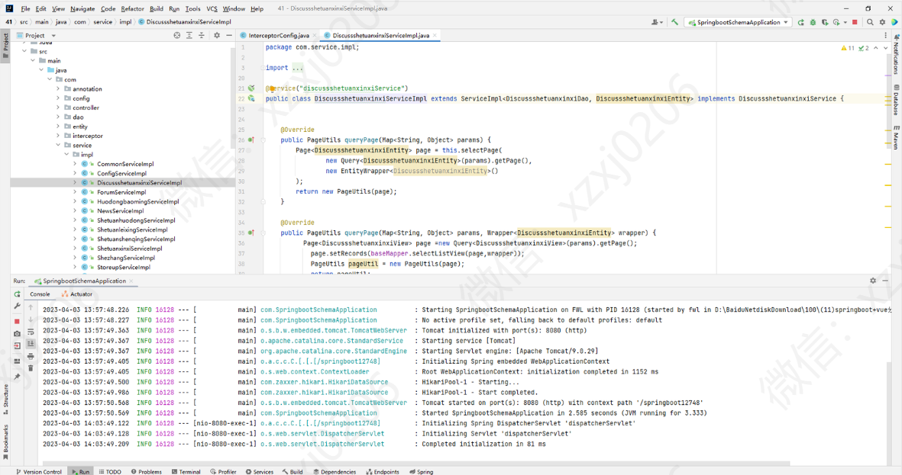

# 大学生社团管理系统

### 9.9￥ 获取完整源码+sql，需要加Q：3577148218 ,备用Q: 3808981644
### 有问题，或者需要协助调试运行项目的也可联系
### 更多项目： https://github.com/34426?tab=repositories

## 一、介绍

基于springboot+ vue前后端分离实现的大学生社团活动平台

### 1、学生功能
个人中心 、 社团申请管理 、 活动报名管理、 我的收藏管理等功能

### 2、社长功能

个人中心 、社团信息管理 、 社团申请管理、 社团活动管理 、活动报名管理 等功能

### 3、管理员功能

个人中心、学生管理 、社长管理 、 社团类型管理 、社团信息管理、 社团申请管理、 社团活动管理等功能

## 二、系统运行界面

### 1、后端

### 2、前端

## 三、部分功能页面展示

### 9.9￥ 获取完整源码+sql，需要加Q：3577148218 ,备用Q: 3808981644
### 有问题，或者需要协助调试运行项目的也可联系

